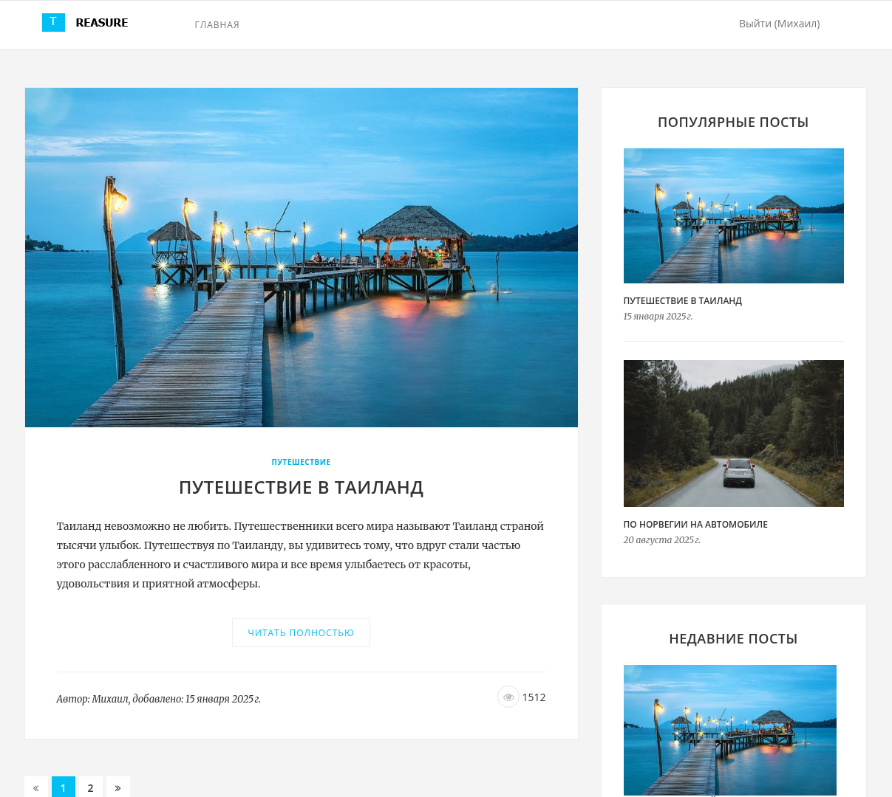

# Блог (на фреймворке Yii2)

Данное веб-приложение представлено в виде блога о путешествиях, и имеет полноценную CMS-систему (Control Management System) для добавления: статей, категорий и тегов, а также мощный JS-редактор текста статей, с возможностями добавления картинок и др. полезными функциями. Зарегистрированные пользователи могут оставлять комментарии под статьями (одобренные администраторами сайта), а незарегистрированные - могут только читать текст статей и комментарии других. За редактирование наполнения сайта и разрешения к публикации комментариев отвечают администраторы и управляют этим при помощи админки, скрытой от обычных пользователей и гостей сайта.

Для доступа к админке сайта, нужно войти под учетной записью администратора. Данные для входа:

Почта: admin@blog-yii2.com \
Пароль: 1234

### Особенности:

1. Профессиональная верстка.
2. Сокрытая админка.
3. CMS-система для добавления контента.
4. Расширенный редактор статей - CKEditor.

\
 \
Веб-интерфейс приложения \
&nbsp;

## Системные требования

- Windows/Linux/macOS.
- Docker.

## Установка и запуск

1. Создайте файл `.env` с переменными среды, методом копирования шаблонного файла `.env.template`.

``` bash
cp ./.env.template ./.env
```

2. Измените значения переменных файла `.env`.

``` bash
APP_PORT=8080

DB_DATABASE=blog-yii2
DB_USER=root
DB_PASSWORD=your_root_password
```

3. Создайте и запустите контейнеры с компонентами приложения.

``` bash
docker compose up -d
```

4. Запустите миграции для задания табличных структур в базе данных.

``` bash
docker compose exec -i app php yii migrate --interactive=0
```

5. Откройте приложение в веб-браузере, перейдя по адресу (откроется в веб-браузере):

[http://localhost:8080/](http://localhost:8080/)
